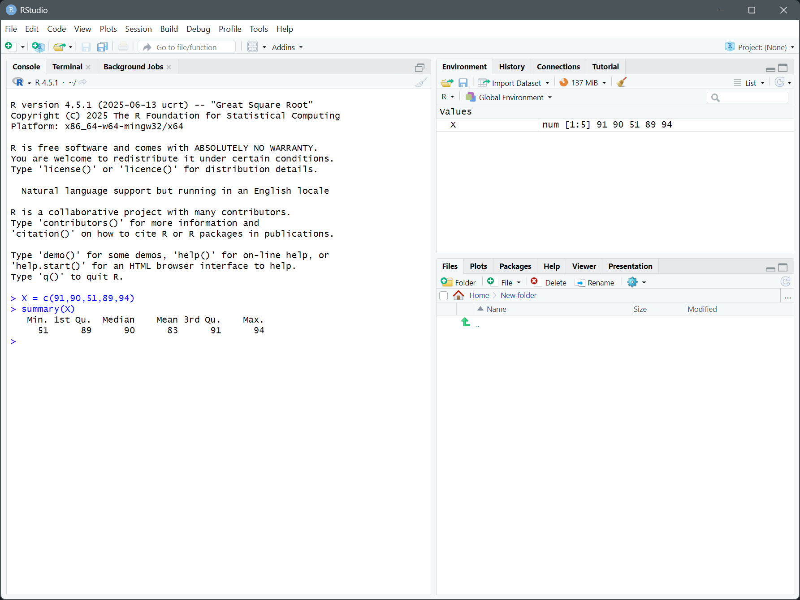
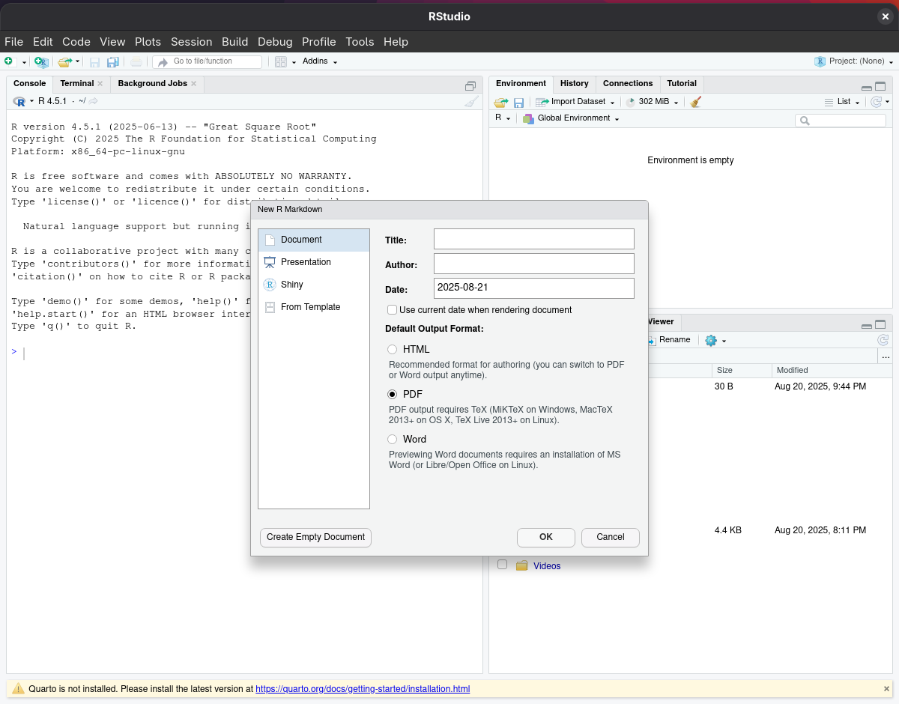

# Installing R, RStudio & R Markdown
R is a Python-inspired programming language with many stats functions built-in. Knowing how to use it will make our lives much easier in MA331.

RStudio is an IDE (Integrated development environment) made especially for R with a live console and a readout of variables in your environment.

R Markdown is a markup language that lets you combine regular text, LaTeX math, and R code execution into one PDF file. It is not required for this course but it might make your life easier. Alternatives include Word or Google Docs, but you have to screenshot everything and paste it in manually.

## Installing R

1. First we need the installer. Head to the [download page](https://cran.rstudio.com/) (https://cran.rstudio.com/). 
    - In the unlikely event that the page is broken or too slow, try [this mirror](https://cran.r-project.org/) (https://cran.r-project.org/). Click "Mirrors" on the left and choose a host close to you. For instance: if you're in Hoboken, the closest mirror host is Carnegie Mellon University in Pittsburgh.
2. Under "Download and Install R," click the link for your OS.
   - Linux users on Arch or Manjaro: skip to step 4.

3. Download the correct installer:
   - Windows: click "base" then "Download R-#.#.# for Windows." The version number is irrelevant because it will always be the latest release.
   - Mac: Click the Apple logo on the top-left of your screen and click "About This Mac." Look for "Version" under "MacOS [Fancy Name]".
     - Versions 13 and above: Next to "Processor" there will be either an Apple silicon M# chip or an Intel chip. Download the binary listed under the chip you have. 
     - Versions below 13: scroll down to "Binaries for legacy macOS/OS X systems" and look for your version. R 4.5 works on macOS 11+ but [users have noticed](https://forum.posit.co/t/r-session-aborted-and-reinstall-did-not-help/200712) (as did I in my research) it doesn't work with RStudio, so install the older version 4.2.3.
     - Versions below 10.13: It is strongly recommended to update your macOS to a higher version as R is difficult to use on these old versions.
   - Linux: Click the name of your distro or, if it's not listed, the name of your base distro. If you don't know your base distro, run `cat /etc/*-release`. (For instance: Linux Mint is built on Ubuntu.) Linux doesn't generally get installer binaries, but CRAN will offer installation guides.

4. Run your installer: 
   - Windows: Run the installer from your downloads folder. Select your language, and keep hitting "Next" to leave all of the default settings. It will install by itself and you can hit "Finish" when it's done.
   - Mac: Run the installer from your downloads folder. Hit "Continue" and "Agree." If it asks for a destination, choose your build-in hard drive. Fill in your password when prompted. When it finishes, you can hit "Close" and move the installation package to Trash.
   - Linux: Each distro has different instructions on the download pages. If you're using Linux I'll assume you know how to follow them. Don't worry about installing R packages right now -- you'll be able to add them from RStudio's "Packages" tab later.
     - Ubuntu: I copy/pasted the commands from the download page into the terminal, agreed to the prompts, and had no problem.
     - Arch/Manjaro: Install the R package https://archlinux.org/packages/extra/x86_64/r/ with `sudo pacman -S r`.


## Installing RStudio

1. Head to Posit's [RStudio download page](https://posit.co/download/rstudio-desktop/) (https://posit.co/download/rstudio-desktop/).
   - Windows: Scroll down and click on "Download RStudio Desktop for Windows." Once it downloads, run "RStudio-20##.##.#-###.exe" and click "Next," then "Install," then "Finish" when it's done. The number on the executable is irrelevant as it is always the most recent version.
   - Mac: You can find your version in the "About This Mac" window from before.
     - macOS 13 and above: Scroll down to "Download RStudio Desktop for macOS 13+" and allow it to download.
     - Versions below 13: Older Mac versions of RStudio are hosted on [RStudio's forum](https://forum.posit.co/t/rstudio-desktop-releases-on-unsupported-versions-of-macos/176074) (https://forum.posit.co/t/rstudio-desktop-releases-on-unsupported-versions-of-macos/176074). Download the version next to your macOS version. When it downloads, open the .dmg, drag the "RStudio" icon into "Applications," then wait for "RStudio" to finish copying. 
   - Linux:
     - Ubuntu: Scroll down to your version of Ubuntu and download the corresponding file. Run it and select "Software Install" when prompted. You'll get some info about RStudio and you can press the green "Install" button. When it changes to a red trash can it is ready to be used.
     - Arch/Manjaro: Go to the [AUR page](https://aur.archlinux.org/packages/rstudio-desktop) (https://aur.archlinux.org/packages/rstudio-desktop) for RStudio and click "Download snapshot." Open your downloads folder once the download finishes. Double-click "rstudio-desktop.tar.gz," open the new folder, and from it open a console and run `makepkg -sirc`. Provide your password when asked and accept the default options (capitalized option) when prompted.

2. Open RStudio.
   - Windows: The installer doesn't create a desktop shortcut but it will be in your Start menu (click the Windows logo on the bottom left). It will ask you to choose a version of R to use the first time you open it: you can leave the default option. It will then ask (only the first time) if you want to send crash reports, and you can choose either Yes or No.
   - Mac: Open Applications and double-click RStudio. On first run, it will be verified and you'll be asked if you want to open it. Click "Open". It will also ask you to install command line developer tools if you haven't before; they are necessary, but you can try out the basics of RStudio while they download.
   - Linux: Find it in your Applications menu or run it from the terminal as `rstudio`. 
     - Ubuntu: If you haven't previously, run `sudo apt install gcc g++ make` so you can build packages later.

3. Test that R and RStudio are working using some common features. Instructions are the same for all platforms.
   - Let's create a column (R's equivalent to arrays) of data. At the console, type in `X = c(91,90,51,89,94)` and hit enter. 
   - We should see on the right, under "Environment", `X | num [1:5] 91 90 51 89 94`. This means that the variable `X` is a column of `num`bers, with indices from 1 through 5, followed by its data. *(N.B.: R indices start at **1**, not 0 like most languages.)*
   - We can also get the five-number summary of X with the `summary()` function. Let's run `summary(X)` in the console. We should see:
      ```
      Min. 1st Qu.  Median    Mean 3rd Qu.    Max. 
        51      89      90      83      91      94 
      ```
   - If you are seeing this:
      
      It means your R and RStudio installations are functional. You now have all the basics for MA331.
   - If you don't see this, try returning to step 1 of this section and reinstalling RStudio. If it is still nonfunctional reach out to a Course Assistant.

4. Some packages are needed to run the code from our recitations. In the console run the following command to install all of them:
   ```r
   install.packages(c("BSDA", "EnvStats", "readxl", "agricolae", "gplots", "readr", "mosaic"))
   ```
   To actually use a package, you can find it in the "Packages" tab on the bottom-right and click the checkbox to its left or just run `library(packageName)` in the R console. RStudio doesn't always know what package a command comes from, so you might need to look up a function it doesn't recognize.

## Installing R Markdown
Head to RStudio's console and send `install.packages(c("tinytex","rmarkdown"))`. 
- Windows and Linux: Answer "Yes" to the dialogue box.
- Mac: Hit enter from the console if it asks "Do you want to install..."

The process should resolve with something like this:
```
* DONE (rmarkdown)

The downloaded source packages are in
‘C:\Users\<USERNAME>\AppData\Local\Temp\RtmpcxZU8e\downloaded_packages’
```
and return control to you. The last step is to send `tinytex::install_tinytex()` in the console.

Now, you can go to the top ribbon and click "File" -> "New File" -> "R Markdown" and get this dialogue:


When you make your Rmd file, make sure your header looks something like this (most importantly, the `output` line):
```
---
title: "Homework 1, MA 331-B"
author: "Jane Doe"
date: "September 2, 2025"
output: pdf_document
---
```
This will make sure your document is exported to the right format and creates a proper header. When you finish your assignment, or if you want to check your output, click "Knit" to export your Rmd into PDF.

[R Markdown: The Definitive Guide](https://bookdown.org/yihui/rmarkdown/) makes a great case for using R Markdown for stats documents and acts as a great guide for the actual use of the format. The [R Markdown Cookbook](https://bookdown.org/yihui/rmarkdown-cookbook/) assumes knowledge of LaTeX and Markdown and has more advanced information about installation and the inner workings of R Markdown.


### Installing different LaTeX dependencies 
If you want to use LaTeX outside of RStudio, you can install these other dependencies.
- Windows: [MiKTeX](https://miktex.org/download) (https://miktex.org/download) has a simple installer and an [official tutorial](https://miktex.org/howto/install-miktex).
- Mac: [MacTeX](https://tug.org/mactex/mactex-download.html) (https://tug.org/mactex/mactex-download.html). The download page seems to have all necessary setup info.
- Linux: A robust option integrated with RStudio is [Quarto](https://quarto.org/docs/get-started/hello/rstudio.html) (https://quarto.org/docs/get-started/hello/rstudio.html) which is easier to install but has a steeper learning curve. The other option is [TexLive](https://www.tug.org/texlive/acquire-netinstall.html) (https://www.tug.org/texlive/acquire-netinstall.html) which is terrible to install but provides the exact same behaviors as Windows and Mac. Both will render Rmd files adequately. You can install TexLive as such:
   ```sh
   cd /tmp
   curl -L -o install-tl-unx.tar.gz https://mirror.ctan.org/systems/texlive/tlnet/install-tl-unx.tar.gz
   zcat < install-tl-unx.tar.gz | tar xf - 
   cd install-tl-2*
   sudo perl ./install-tl --paper=letter --no-doc-install --no-src-install --scheme=medium --no-interaction
   ```
   Then, to be able actually use it, add `export PATH="/usr/local/texlive/<XXXX>/bin/x86_64-linux:$PATH"` somewhere in your `~/.bashrc` then `source ~/.bashrc`. Change `XXXX` to the year of the version you installed. It's also the first 4 numbers in `install-tl-2*` which the `cd` line will automatically detect. 

   Be aware that the installation is painfully slow. `time` gave just the installation script 26 min 27 sec.

**Remember that you must submit the PDF export, not the .Rmd source files.**

# Alternatively, VS Code
I can only offer help on the Windows version of VS Code. Google is your friend as VS Code is a very popular a well-documented IDE.
- Install the [R extension](https://marketplace.visualstudio.com/items?itemName=REditorSupport.r) (https://marketplace.visualstudio.com/items?itemName=REditorSupport.r) to get language support and an integrated R console. 
- R Markdown in VS Code requires pandoc. If you try to install it from R or RStudio it will not install a high enough version. Instead, download the installer from the [developer's repository](https://github.com/jgm/pandoc/releases) (https://github.com/jgm/pandoc/releases) and then add the installed files to your path by `setx path "%PATH%;C:\Users\<USERNAME>\AppData\Local\Pandoc"` where `<USERNAME>` is replaced with your username. You must run Command Prompt as an administrator to run `setx`.
  - If you chose to install for all users, also include `C:\Program Files\Pandoc`